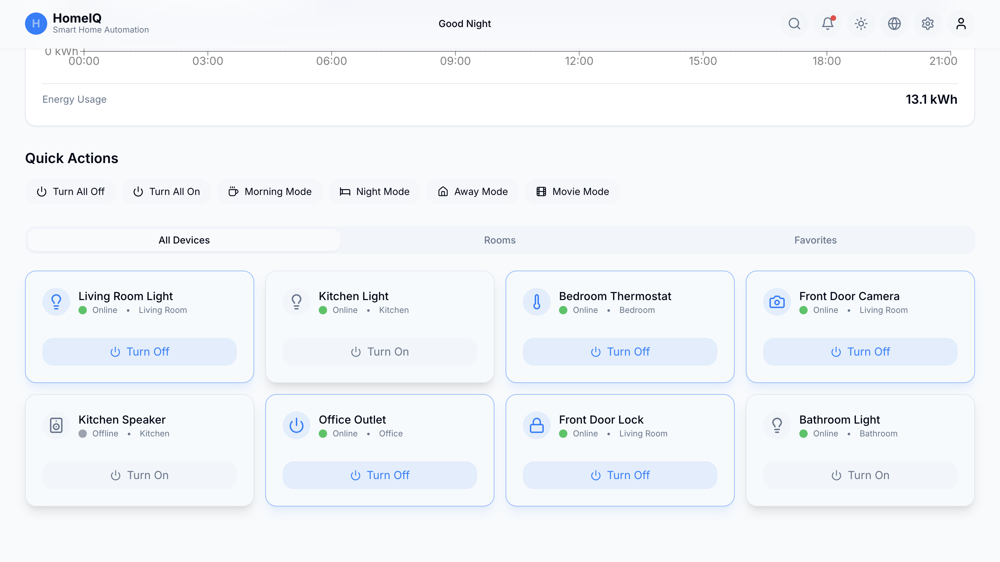

# 🏡 Smart Home Automation



🚀 **Live Demo:** [Smart Home Automation](https://basit-dev-de.github.io/smart-home-automation/)

## 📌 Overview

The **Smart Home Automation** platform enables users to control and monitor their smart home devices effortlessly. With real-time updates, scheduling automation, and voice assistant integration, it provides a seamless and intelligent home management experience.

## ✨ Features

- ✅ **Device Control Dashboard** – Manage lights, thermostats, security cameras, and more.
- 🎤 **Voice Assistant Integration** – Works with Alexa, Google Assistant, and Siri.
- ⏰ **Automation & Scheduling** – Set routines and timers for automated control.
- 🌍 **Remote Access** – Control devices from anywhere via a web interface.
- ⚡ **Energy Monitoring** – Optimize electricity usage with real-time analytics.
- 🔐 **Security & Surveillance** – Live streaming, motion detection, and cloud storage.
- 🎨 **Customizable UI** – Light/Dark mode, dynamic themes, and drag-and-drop interface.

## 🛠 Tech Stack

### **Frontend**

- **Languages**: TypeScript, JavaScript (ES6+)
- **Frameworks & Libraries**: React.js, Vite
- **Styling**: Tailwind CSS, CSS-in-JS (Styled Components, Emotion CSS)
- **State Management**: Redux Toolkit, Context API
- **API Integration**: WebSockets for real-time updates

### **Automation & AI**

- **Voice Assistant Integration**: Alexa, Google Assistant, Siri
- **IoT & Smart Devices**: MQTT Protocol, WebSockets
- **AI-powered Automation**: Machine Learning for user behavior prediction

### **Testing & Dev Tools**

- Jest, Cypress, React Testing Library
- GitHub Actions, Docker, Vercel

## 📦 Installation & Setup

Clone the repository and install dependencies:

```sh
git clone https://github.com/basit-dev-de/smart-home-automation.git
cd smart-home-automation
npm install
```

### 🚀 Run the Application

```sh
npm run dev
```

## 🤝 Contribution

Contributions are welcome! Feel free to fork the repo and submit a pull request.

## 📬 Connect with Me

- **GitHub:** [basit-dev-de](https://github.com/basit-dev-de)
- **Portfolio:** [Standout Dev Experience](https://basit-dev.com)
- **Email:** [basit.ali@toptal.com](mailto:basit.ali@toptal.com)

🚀 **Control your home smarter with this automation platform!**
